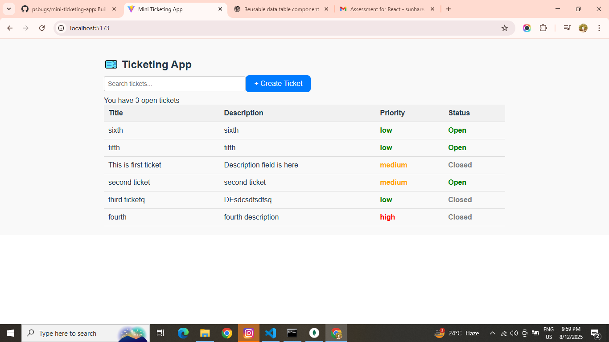

# 🎫 Mini Ticket Management App

A simple **React-based mini ticket tracking system** with context API for  state management, reusable table components, and a clean modular architecture.  
This app allows you to create, search, and manage tickets with priority & status controls.

---

## 🚀 Features

- **Create and Manage Tickets**
- **Search Filter** by title or description
- **Status Toggle** (Open / Closed) by clicking on the status cell
- **Priority-based Styling** (High = Red, Medium = Orange, Low = Green)
- **Reusable DataTable Component** for displaying tabular data across modules
- **Context API** for centralized ticket state management

---

## 🛠️ Tech Stack

- **React 19+**
- **Context API** for state
- **JavaScript (ES6+)**
- **Vite** for fast development
- **CSS Modules / Plain CSS** for styling

---

## 📂 Project Structure

```

src/
├── assets/
│ └── common/
│ └── DataTable.jsx # Reusable table component
│
├── components/
│ ├── Modal/
│ │ └── Modal.jsx # Modal component
│ │
│ ├── TicketCounter/
│ │ └── TicketCounter.jsx # Ticket statistics
│ │
│ ├── TicketForm/
│ │ └── TicketForm.jsx # Form to create/edit tickets
│ │
│ ├── TicketList/
│ │ └── TicketList.jsx # Ticket listing with reusable DataTable
│ │
│ └── TicketSearch/
│ └── TicketSearch.jsx # Ticket search bar
│
├── context/
│ └── TicketContext.jsx # Global ticket state using Context API
│
├── pages/
│ └── Home.jsx # Main landing page
│
├── App.jsx # Root component
├── App.css # Global styles
├── index.css # Base styles
└── main.jsx # App entry point

````

---

## 🔧 Installation & Setup

```bash
# Clone the repo
git clone https://github.com/psbugs/mini-ticketing-app.git

# Navigate into the project
cd mini-ticketing-app

# Install dependencies
npm install

# Start development server
npm run dev
````

---

## 📜 Usage

1. **Add Tickets** – Use the ticket form to create a new ticket.
2. **Search** – Enter a keyword in the search bar to filter tickets.
3. **Toggle Status** – Click the **Status** cell to toggle between `Open` and `Closed`.
4. **Priority Colors**:

   * 🔴 **High** – Red
   * 🟠 **Medium** – Orange
   * 🟢 **Low** – Green

---

## ♻ Reusable DataTable

The `DataTable` component is fully reusable across modules.

**Example usage in `TicketList.jsx`:**

```jsx
<DataTable
  columns={[
    { key: "title", label: "Title" },
    { key: "description", label: "Description" },
    {
      key: "priority",
      label: "Priority",
      style: (value) => ({
        color: value === "high" ? "red" : value === "medium" ? "orange" : "green",
        fontWeight: "bold"
      }),
    },
    {
      key: "status",
      label: "Status",
      style: (value) => ({
        cursor: "pointer",
        color: value === "Open" ? "green" : "gray",
        fontWeight: "bold"
      }),
      onClick: (row) => onToggleStatus(row.id),
    },
  ]}
  data={filteredTickets}
/>
```

---

## 🖼 Screenshot


---

## 📄 License

This project is licensed under the **MIT License** – free to use and modify.

---

## 👨‍💻 Author

* **Praveen Sunhare** – [GitHub](https://github.com/psbugs)

These are my detailed answers for several questions :

1. Component Structure
I followed a feature-based folder structure where each feature (TicketList, TicketForm, TicketSearch, TicketCounter, Modal) has its own directory. This keeps related files together and makes the codebase scalable. Common reusable UI logic, like DataTable, lives in a shared common folder. Pages such as Home.jsx aggregate these components to form complete views. This approach avoids a flat “dump” of components and supports future growth without losing maintainability.

2. State Management
Ticket data is stored in TicketContext using React’s Context API. This allows multiple components (list, counter, search, form) to access and update tickets without deep prop drilling. Local UI states, like form inputs or modal open/close, are managed within their respective components to keep state ownership clear and avoid unnecessary re-renders.

3. Performance Considerations
For 1,000+ tickets, I’d add virtualized rendering (e.g., react-window) to only render visible rows. I’d also debounce search input to reduce filtering frequency. Memoization (useMemo, useCallback) would ensure derived data (filtered list) doesn’t recompute unnecessarily.

4. Search Behavior
I’d implement debounced search to avoid filtering on every keystroke. Search could be case-insensitive, highlight matched text, and support multiple fields (priority, status). For large datasets, I’d move filtering to the backend and use server-side search with pagination. Adding a “clear search” button improves UX.

5. What did you Google or use GPT for?
I used GPT for structuring a reusable DataTable component and for creating a clean, professional README format. I also referenced GPT for folder structure formatting in Markdown. This allowed me to save time, follow best practices, and keep my implementation maintainable.